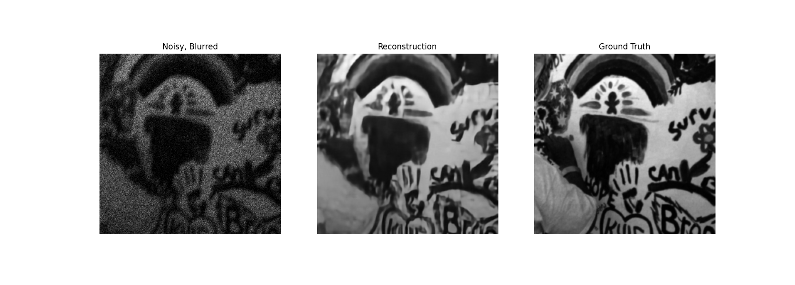

## Offical PyTorch code for ["Photon-Limited Blind Deconvolution Using Unsupervised Iterative Kernel Estimation"](https://ieeexplore.ieee.org/document/9982288)


## Instructions
1. Create a local copy of repository using the following commands
      ```console
      foor@bar:~$ git clone https://github.com/sanghviyashiitb/photon-limited-blind.git
      foor@bar:~$ cd photon-limited-blind
      foor@bar:~/photon-limited-blind$ 
      
      ```
3. Download the pretrained models, i.e. denoiser and p4ip  into ```model_zoo``` from the link [here](https://drive.google.com/drive/folders/1NvLzQZGjIwNFzScY_cUy8yZ8rQxxQSDX?usp=sharing)
4. Download the zip file containing [Levin dataset](https://drive.google.com/file/d/1UDLpelcii-Gt4KKvlltyuPh5PiyN1kKR/view?usp=sharing) into the main directory and unzip using the following command:
      ```console
      foo@bar:~/photon-limited-blind$ unzip levin.zip -d data/ 
      ```
      
5. To test the network using real data, run the file 
      ```console
      foo@bar:~/poisson-deblurring$ python3 demo_deconv.py  
      ```
      
      
      

 ### Citation
 
 ```
@ARTICLE{9982288,
  author={Sanghvi, Yash and Gnanasambandam, Abhiram and Mao, Zhiyuan and Chan, Stanley H.},
  journal={IEEE Transactions on Computational Imaging}, 
  title={Photon-Limited Blind Deconvolution Using Unsupervised Iterative Kernel Estimation}, 
  year={2022},
  volume={8},
  number={},
  pages={1051-1062},
  doi={10.1109/TCI.2022.3226947}}
 ```

Feel free to ask your questions/share your feedback at sanghviyash95@gmail.com
